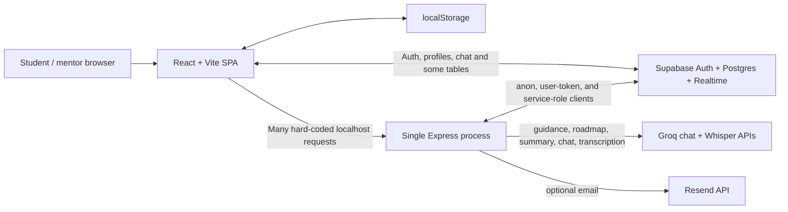

# Aage Kya: current-state audit

Audit date: 2026-07-19  
Audited revision: `457d02d` (`main`)  
Scope: every tracked application, server, schema, seed, configuration, test, and documentation file in the repository.

## Executive assessment

The repository is a useful product prototype, not a safe production guidance platform yet. It demonstrates a coherent student journey—onboarding, AI-generated options, roadmap, saved scenarios, a rank simulator, mentors, Q&A, and a dashboard—but facts, eligibility, costs, probabilities, and mentors are not backed by an auditable current dataset. Several UI promises overstate what the implementation can prove.

The build passes, but production API calls are hard-coded to localhost, the server cannot start without Supabase variables, lint and server tests fail, the database policies permit role escalation and other direct-client authorization bypasses, and a tracked example environment file contains real-looking privileged credentials. These are release blockers.

Recommended disposition: preserve the journey and reusable UI, replace the data and decision core, introduce provenance and versioned migrations, harden authorization, and make the LLM a bounded explanation layer over deterministic evidence—not the source of truth.

## Pre-change verification baseline

| Check | Result | Evidence / implication |
|---|---|---|
| Frontend dependency install | Pass | `npm ci`; 349 packages |
| Server dependency install | Pass | `server/npm ci`; 89 packages |
| Production build | Pass | Vite built 140 modules; app JS 271.12 kB, Supabase 170.83 kB, React 141.72 kB before gzip |
| Lint | Fail | 51 errors and 5 warnings: unused code, empty catches, hook dependency problems, and unescaped JSX text |
| Server integration tests | Fail | Startup fails because the fallback Supabase URL is not a valid URL; all 7 tests are cancelled/timed out |
| Server syntax | Pass | `node --check server/index.js` |
| Dependency audit | Fail | Root has one high and one moderate Vite/esbuild advisory; server reports none |
| Runtime visual inspection | Blocked by tool boundary | The in-app browser could not connect to the host-local Vite server. Static UX review and production build inspection were completed; browser E2E remains required. |

The first foundation slice performed after this audit restored passing lint, build, degraded-mode server tests, and a zero-vulnerability npm audit. See `FOUNDATION_IMPLEMENTATION.md`; findings about the original revision remain the basis for the roadmap.

## Current architecture

This is a split-authority architecture: some authorization and writes occur directly through Supabase RLS, while other writes pass through Express. The rules are therefore duplicated and inconsistent. The backend is a 1,900-line monolith containing configuration, middleware, data access, prompts, business rules, external integrations, and 28 endpoints.

## Feature inventory

### Student-facing

- Landing page and class 10 / class 12 onboarding.
- AI-generated guidance cards and a printable result.
- AI-generated career roadmap.
- Static course-reality cards and user feedback.
- Rank-based college predictor and what-if simulator.
- Saved scenarios, profile re-onboarding, task tracker, and JSON “academic wallet.”
- Mentor discovery, realtime mentor chat, mentor-session requests, Q&A, notifications, and chatbot.
- Parent mode and an official-readiness checklist.
- Supabase email/password and magic-link authentication.

### Mentor-facing

- Mentor application form.
- Mentor dashboard, chat, session notes, Q&A answers, and profile editing.

### Operations and data

- Seed script for colleges, scholarships, mentors, and cutoffs.
- Public aggregate analytics endpoint and SQL views.
- Optional Resend email helper.
- Vercel SPA configuration and a server `Procfile`.

## Detailed audit findings

### 1. Frontend structure and component quality

The SPA is understandable and pages are separated under `src/pages`, with shared components and one auth context. Visual language is consistent. However, pages own networking, storage, business rules, and rendering simultaneously; error handling is mostly `alert`, silent catches, or optimistic success. All routes are eagerly imported, there is no error boundary or 404 route, and authenticated/mentor routes are protected only by page-level effects rather than a central route guard.

`src/api.js` is a useful start but is almost unused. At least 22 calls in the UI hard-code `http://localhost:5000`, so a deployed SPA cannot reach its configured API. State is duplicated among component state, localStorage, Supabase, and backend caches. Result, onboarding, dashboard, predictor, mentor, print, and scenario logic should be decomposed into domain clients and query/state hooks.

### 2. Backend architecture and API design

`server/index.js` combines every concern in one process. Endpoints are unversioned, response envelopes are inconsistent, pagination is absent, raw error strings can be returned, and there is no centralized 404/error middleware. Several write routes report simulated success when persistence is unavailable. The public analytics endpoint uses privileged database access without administrator authorization.

The server creates Supabase clients at module load using invalid fallback strings, so even `/api/health` cannot run without secrets. There are no explicit dependency readiness checks, request IDs, schema registry/OpenAPI contract, job queue, distributed cache, idempotency keys, or audit events.

### 3. Database schema and data modelling

`supabase_schema.sql` is a monolithic, partially repeated bootstrap script rather than a migration history. Guidance, roadmaps, profiles, history, wallets, and scenario comparisons are mostly JSONB. This is fast for a prototype but prevents reliable filtering, lineage, longitudinal comparison, and constraints.

Missing core entities include institution identifiers and aliases, campuses, programs, accreditations, admission cycles, exams, counselling authorities, rounds, quotas, categories, seat pools, cutoff measures, fees by component/year/category, scholarships and award rules, source documents, source snapshots, verification reviews, deadlines, recommendations, evidence links, model runs, consent records, and audit logs.

There are few check constraints or controlled enums for marks, income, roles, statuses, dates, and ratings. Source freshness and confidence cannot be represented.

### 4. Authentication, authorization, and roles

Supabase Auth is appropriate for the current stack, but authorization is unsafe:

- A student owns and can update the entire `students` row, including `role`; the server then trusts that role. A user can promote themself to mentor through the direct Supabase client.
- The Q&A update policy lets either a mentor or the author update the whole post, allowing an author to set answer and mentor fields directly.
- Student `FOR ALL` access to mentor sessions permits changes beyond the intended rating action.
- Users have `FOR ALL` access to their notifications and can insert fabricated notifications.
- Mentor applications permit anonymous insertion without durable abuse protection at the database edge.

Roles need an administrator-controlled membership table or signed auth claims, least-privilege policies, column-sensitive RPCs, and authorization tests.

### 5. Current AI flow and prompt design

The code names its central function `callGemini`, the README describes Gemini, and the actual provider is Groq using one hard-coded model. Guidance, roadmaps, parent summaries, chatbot replies, and transcription are provider calls embedded in route handlers.

Prompts label seed records “VERIFIED” even though they have no per-fact citations or verification dates. Guidance asks the LLM to generate colleges, costs, exams, outcomes, and scholarship matches. Output is parsed as JSON but not validated against a runtime schema. There is no provider abstraction, timeout, retry policy, circuit breaker, fallback, token budget enforcement, prompt version, evaluation suite, safety policy, or citation validation. Some calls are cached on incomplete keys; a user's changed profile can receive a stale prior result.

### 6. Recommendation logic

The database shortlist filters colleges by stream, broad board-mark proximity, and state/national scope, then sorts by minimum marks. It does not model a program, admission year, exam, score/rank type, category, quota, domicile, counselling round, gender/seat pool, budget, hostel, language, location radius, or personal constraints. The LLM then invents the final structured option.

The existing “confidence” score measures profile completeness, not the probability or reliability of a recommendation. Scholarship matching can fall back to the first available scholarship even when no rule matches. These labels are misleading and should be separated into profile completeness, evidence coverage, model uncertainty, and admission probability.

### 7. College matching and ranking

The predictor has a small static fallback (84 rows, 12 institution labels, three years) for JEE/KCET/NEET. It treats all JEE paths as one exam, lacks rounds and quotas, and applies fixed 80% / 100% / 110% cutoff bands. The `state` request parameter is not used. It calls the newest cutoff `closing2025` even when the newest data year differs.

Known validity failures include a non-existent “AIIMS Mumbai” and BITS Pilani represented through JEE rank despite BITS admissions using BITSAT. “Safe/Likely/Borderline” is therefore a demo heuristic, not a calibrated admission forecast.

### 8. Fee estimates and affordability

Fees are institution-level annual ranges with no course, academic year, tuition/hostel/mess/deposit/travel split, category, domicile, waiver, escalation, or source snapshot. Guidance returns one yearly number and a rough four-year multiplication. It cannot calculate realistic total cost, cash-flow timing, scholarship probability, loan need, or family affordability.

### 9. Exam and eligibility guidance

The exam reference is a static set of seven exams and mixes eligibility, dates, format, and attempts in UI code. It contains stale or incorrect simplifications, including CLAT age limits and outdated NEET age/format details. It omits many central, state, course-specific, diploma, vocational, design, law, agriculture, nursing, teaching, and scholarship exams. Eligibility should be rules-as-data tied to an admission cycle and authoritative notice.

### 10. Scholarships

Scholarship seed data lacks application windows, current scheme version, exact rule expressions, award components, renewal conditions, official documents, source checksums, and verification dates. Several amounts and statuses are stale; NTSE is presented as current despite its discontinued/paused status. The code's selected columns do not include a field that matching logic tries to use, silently weakening eligibility checks.

### 11. Mentors, chat, and community

The application falls back to fabricated mentor identities, outcomes, reviews, availability, and Calendly URLs and shows them as online. The frontend has a second fake fallback. String fallback IDs do not match the UUID chat schema. Applications can return simulated success when no database exists.

Realtime chat is a functional prototype, but it lacks verification workflows, background checks, consent/guardian controls for minors, reporting/blocking, content moderation, attachment controls, retention, safeguarding escalation, availability/calendar truth, and service-level expectations.

### 12. Analytics and dashboards

The dashboard is visually useful but combines server records and local-only state. Task completion and official-readiness state remain in localStorage; the wallet is an untyped JSON array. Analytics are simple aggregate views rather than product funnels, recommendation quality, data freshness, admission outcomes, fairness, model quality, or operational metrics. The analytics HTTP endpoint should not be public.

### 13. UX and product flow

The core sequence is intuitive and empathetic, and class-specific entry is a good base. Important gaps are autosave with recovery, edit/recalculate flows, side-by-side comparisons, source drill-down, uncertainty explanations, deadline actions, parent/guardian collaboration, regional-language completion, low-bandwidth/offline behavior, and a clear “why this option” evidence view.

Onboarding does not capture enough decision variables: exact exams/scores/ranks, category/quota/domicile, preferred program level, budget and cash flow, commute/hostel limits, accessibility, language, career goals, work preferences, family constraints, and willingness to relocate.

### 14. Accessibility

There are isolated labels and focus styles, but accessibility is not systematic. Modals lack dialog semantics, focus trapping, Escape behavior, and restored focus. Motion does not respect `prefers-reduced-motion`. Emoji frequently act as icons, error/status announcements are not live regions, keyboard and screen-reader testing are absent, and a dark-only palette needs formal contrast verification.

### 15. Responsive behavior and mobile usability

Tailwind breakpoints and stacked layouts provide a reasonable mobile baseline. Dense cards, long result pages, large forms, print assumptions, fixed overlays, mentor chat, and tables need device testing. There is no performance budget for low-cost Android devices or slow networks.

### 16. Loading, empty, error, and edge states

Several pages have spinners or empty messages, but behavior is inconsistent. Silent catches can show success after failed writes. There is no shared error taxonomy, retry action, offline state, stale-data banner, partial-result state, or request cancellation. Multiple-submit and navigation-away cases are not consistently guarded.

### 17. Performance

The production bundle is moderate but all routes are eager. Supabase and the app each contribute large chunks; code splitting, lazy routes, dependency review, and asset strategy are absent. Google Fonts are fetched via CSS `@import`. Server-side JavaScript filtering, full-list responses, large prompt injection, base64 transcription, and in-memory rate-limit maps do not scale horizontally.

### 18. Security and privacy

Release blockers:

- `server/.env.example` contains real-looking Supabase URL, anon token, and service-role token. Treat them as exposed: revoke/rotate, review logs, and replace the file with placeholders.
- Role escalation and broad RLS policies allow direct-client authorization bypasses.
- CORS is open to every origin when an environment variable is omitted.
- The public analytics endpoint uses service privileges.
- Sensitive profiles and AI results are persisted in browser localStorage.
- Consent is an unversioned local boolean; there is no server record, withdrawal, retention/deletion process, provider disclosure, or guardian flow for minors.
- Logs include IPs, user identifiers, and email destinations without a redaction/retention standard.

Additional gaps: no security headers, CSRF/threat model, dependency automation, secret scanning, audit log, content moderation, data export/delete workflow, encryption classification, backups/restore evidence, or incident runbook.

### 19. Environment handling and configuration

Frontend and backend accept invalid placeholders instead of validating configuration. Documentation describes Gemini while code requires Groq. Optional Resend and origin variables are undocumented or incomplete. There is no typed configuration, startup summary, environment separation, secret-manager guidance, or safe degraded mode.

### 20. Deployment readiness

`vercel.json` can deploy the SPA and `Procfile` can start the backend, but they are not a production system. There is no Docker image, health/readiness split, database migration command, CI/CD pipeline, preview environment, rollback, backup verification, observability, alerting, worker deployment, or infrastructure definition. Frontend/backend origin configuration is already broken by hard-coded URLs.

### 21. Tests and CI/CD

There are seven server smoke tests and no frontend unit/component tests, recommendation golden tests, authorization/RLS tests, accessibility tests, browser E2E, data validation, load tests, or CI workflow. The current smoke suite cannot boot. High-risk decision rules need deterministic fixtures and backtesting before any “probability” is shown.

### 22. Code quality and maintainability

Strengths include readable naming, a coherent visual system, and enough modular UI to preserve. Risks include the server monolith, page-sized components, duplicated networking/constants/fallback data, misleading names (`callGemini`), broad JSON objects, unused dependencies, empty catches, stale comments, and no contract between frontend/backend/AI/database.

### 23. Documentation

The README is short and stale: it names the wrong AI provider, lacks schema/migration steps and the real endpoint inventory, and does not explain security, data provenance, test limitations, or deployment topology. There are no architecture decisions, data dictionary, API specification, operations runbooks, contribution standards, or model/data cards.

### 24. Prototype, fake, and hard-coded behavior

- Fabricated mentor profiles, testimonials, review counts, online state, student stories, and booking links.
- Unsupported marketing claims such as “40K+ students helped” and “300+ verified mentors.”
- Simulated success for mentor applications and course feedback.
- Hard-coded fee ranges, cutoffs, college marks, scholarship awards, exam rules, course outcomes, and videos without field-level provenance.
- Hard-coded localhost backend URLs throughout production UI code.
- Template parent mode presented alongside AI features without an evidence distinction.

Production policy should be explicit: demo records are visibly labelled and never mixed with verified records; success is never returned without persistence; marketing metrics come from audited analytics; and every consequential fact has a source, effective period, and verification state.

### 25. Data freshness, validity, and source traceability

The current schema cannot answer “who verified this value, against which official document, for which admission cycle, and when does it expire?” `source_url` usually points to a homepage, not a notice or fee sheet. Cutoffs have no round/quota/seat-pool source. Fees and scholarships have no effective dates. There are no ingestion jobs, change detection, review queues, checksums, expiry rules, or stale-data UI.

This is the central product risk. The platform should not claim decision confidence until provenance coverage and source freshness are measurable.

## Reuse, refactor, replace

### Reuse

- The class-specific journey, navigation concepts, card visual language, print concept, saved-scenario concept, and Supabase Auth base.
- Realtime chat only after safeguarding and authorization hardening.
- The predictor UI as an explanatory comparison surface, not as its current engine.

### Refactor

- Page networking into a single API client and typed domain services.
- Express into modules for config, auth, validation, data access, recommendations, AI, and integrations.
- Profile/onboarding into a versioned, autosaved decision profile.
- Dashboard into server-backed tasks, deadlines, documents, and history.

### Replace

- Seed facts and fake people with sourced, versioned data.
- LLM-generated recommendations with a deterministic candidate/rules/ranking pipeline plus a bounded explanation agent.
- Cutoff band heuristics with an admission-cycle-aware, backtested range methodology.
- Broad JSONB decision records and permissive policies with normalized entities, append-only evidence, and least-privilege actions.

## Gap summary against the target product

| Target capability | Current maturity | Required change |
|---|---:|---|
| Personalized profile | 2/5 | Add exams, eligibility, budget, constraints, goals, consent, and profile versioning |
| Trustworthy recommendations | 1/5 | Deterministic evidence pipeline, rule engine, ranked alternatives, citations, evaluation |
| College/course intelligence | 1/5 | Normalized institutions/programs/cycles/recognition/source snapshots |
| Cost and affordability | 1/5 | Component-level fees, escalation, living costs, aid rules, cash-flow scenarios |
| Admission chance | 1/5 | Round/quota/category-aware historical data, uncertainty bands, backtesting |
| Exams and scholarships | 1/5 | Official-cycle rule records, deadline ingestion, eligibility engine |
| Mentors/community | 1/5 | Verified identities, safeguarding, moderation, truthful availability |
| Parent and low-bandwidth UX | 2/5 | Evidence-first summaries, multilingual content, PWA/offline/assisted flows |
| Security/privacy | 1/5 | Secret rotation, role redesign, RLS tests, consent/retention/delete workflows |
| Operations | 1/5 | CI/CD, migrations, observability, queues, backups, incident procedures |

The target architecture, schema, APIs, algorithms, source policy, and implementation sequence are defined in the companion documents.
