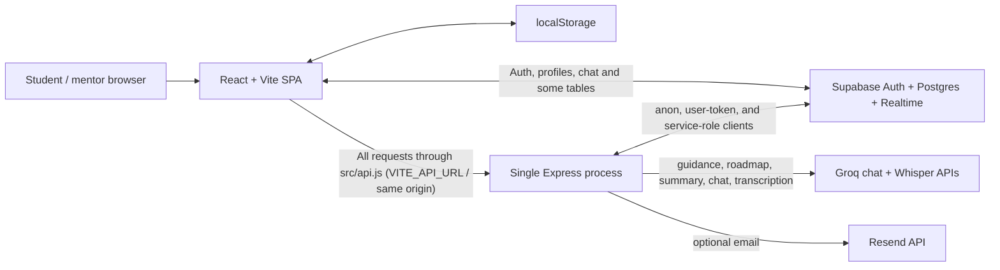

# Aage Kya: current-state audit

Audit date: 2026-07-19  
Audited revision: `457d02d` (`main`)  
Scope: every tracked application, server, schema, seed, configuration, test, and documentation file in the repository.

Last re-verified: 2026-07-26 against the working tree at `b914b1a` plus the uncommitted hardening changes of that date. Findings below are the original audit unless a “Status (2026-07-26)” note follows them; see “Current state re-verification” for the measured baseline and the list of items still open.

## Executive assessment

The repository is a useful product prototype, not a safe production guidance platform yet. It demonstrates a coherent student journey—onboarding, AI-generated options, roadmap, saved scenarios, a rank simulator, mentors, Q&A, and a dashboard—but facts, eligibility, costs, probabilities, and mentors are not backed by an auditable current dataset. Several UI promises overstate what the implementation can prove.

The build passes, but production API calls are hard-coded to localhost, the server cannot start without Supabase variables, lint and server tests fail, the database policies permit role escalation and other direct-client authorization bypasses, and a tracked example environment file contains real-looking privileged credentials. These are release blockers.

Status (2026-07-26): the localhost hard-coding, the lint failures, the failing/cancelled server tests, and the tracked example credentials have been fixed; the RLS/role-escalation redesign still depends on an operator applying the security migration. The data-trust findings below (provenance, fees, cutoffs, eligibility, scholarships, mentors) are unchanged and remain the reason this is not a production guidance platform.

Recommended disposition: preserve the journey and reusable UI, replace the data and decision core, introduce provenance and versioned migrations, harden authorization, and make the LLM a bounded explanation layer over deterministic evidence—not the source of truth.

## Pre-change verification baseline

| Check | Result | Evidence / implication |
|---|---|---|
| Frontend dependency install | Pass | `npm ci`; 349 packages |
| Server dependency install | Pass | `server/npm ci`; 89 packages |
| Production build | Pass | Vite built 140 modules; app JS 271.12 kB, Supabase 170.83 kB, React 141.72 kB before gzip |
| Lint | Fail | 51 errors and 5 warnings: unused code, empty catches, hook dependency problems, and unescaped JSX text |
| Server integration tests | Fail | Startup fails because the fallback Supabase URL is not a valid URL; all 7 tests are cancelled/timed out |
| Server syntax | Pass | `node --check server/index.js` |
| Dependency audit | Fail | Root has one high and one moderate Vite/esbuild advisory; server reports none |
| Runtime visual inspection | Blocked by tool boundary | The in-app browser could not connect to the host-local Vite server. Static UX review and production build inspection were completed; browser E2E remains required. |

The first foundation slice performed after this audit restored passing lint, build, degraded-mode server tests, and a zero-vulnerability npm audit at the time it ran. See `FOUNDATION_IMPLEMENTATION.md`; findings about the original revision remain the basis for the roadmap. The audit position is no longer zero — two moderate advisories are now accepted, as recorded below.

## Current state re-verification (2026-07-26)

Measured against the working tree of that date, not the audited revision.

| Check | Result | Evidence / implication |
|---|---|---|
| Lint | Pass | `npm run lint`, zero errors and zero warnings |
| Production build | Pass | Vite 6.4.3; `index` chunk 659.52 kB, `supabase` 171.10 kB, `router` 166.17 kB, CSS 99.73 kB before gzip. Rollup emits the >500 kB chunk warning; all routes are still eager |
| Test suite | Pass | `node --test` in `server/`: 156 tests, 28 suites, 156 pass, 0 fail, 0 cancelled, 0 skipped. Includes the previously unbootable integration suite |
| Frontend dependency audit | 2 moderate | Root: 0 critical, 0 high, 2 moderate, all in the `react-router` line. Accepted risk, see below |
| Server dependency audit | Pass | `server/`: 0 vulnerabilities. Transitive `body-parser` is 1.20.6 via express 4.22.2 |
| CI gate | Runs, gates at high | `.github/workflows/ci.yml` runs install, lint, build, tests, and both audits on Node 22; both audit steps now gate at `--audit-level=high`, so any high or critical advisory fails the build. The two moderate `react-router` advisories stay unblocked deliberately and are recorded in the workflow comments |
| Frontend API coupling | Pass | No `localhost` literal remains anywhere under `src/` except two explanatory comments in `src/api.js`. 15 modules import the shared client |
| Runtime/browser E2E | Still not run | Unchanged from the original audit; no browser, device, or accessibility E2E exists |

### Accepted dependency risk

Vite is on 6.4.3, `@vitejs/plugin-react` on 4.7.0, and `react-router-dom` is held at 6.30.4 in both `package.json` and the lockfile. The lockfile had previously drifted to 7.18.1, which carried a high-severity RSC CSRF advisory; reverting to 6.30.4 cleared the highs and left two moderate advisories against `react-router` (`6.0.0 - 7.17.0`): an open redirect via backslash in `<Link>`/`useNavigate`, and arbitrary constructor injection through `deserializeErrors()` during SSR hydration. The machine-readable audit output additionally lists an open-redirect-to-XSS advisory against `react-router-dom` `6.30.2`–`6.30.4` itself, which the installed version is inside.

There is no patched release in the 6.x line. The advertised fix is `>=7.18.0`, which is the version that carried the high-severity advisory, and clearing the moderates for good means migrating off `react-router-dom` to `react-router` 8 across two majors. The SSR hydration path is not reachable — this is a client-only SPA with no server rendering — so the residual exposure is the redirect handling. This is a known, accepted, unfixed risk, not a resolved finding, and the router migration belongs in a planned slice.

### Known broken or orphaned code (verified 2026-07-26)

- `src/pages/FeeExplorer.jsx` is non-functional and, as re-checked on 2026-07-26, was never reachable in the first place: `src/App.jsx` contains no import and no `<Route>` for it, and nothing under `src/` links to it, so there was no route to remove. It imports `getVerifiedFeePlan` and `getVerifiedFeePlans` from `../api`, neither of which exists in `src/api.js`, and the backend routes they would call (`GET /api/fees/pilot`, `GET /api/fees/pilot/:id`, `POST /api/fees/calculate`) do not exist in `server/index.js` — they are described only in `FEE_RESEARCH_PILOT.md`. The file is kept on disk as reference work with a header comment block stating that it is unrouted, which imports are missing, and that the `/api/fees/*` endpoints were never implemented. Rollup does not fail the build on the missing named imports, so CI would not catch the breakage if the page were ever routed.
- `getMockGuidance` has been removed from `server/index.js`. Its only caller was the deleted local `callGemini` helper; `getMockRoadmap` and `getMockCustomCareerPath` remain live and are unchanged.
- `zod` and `@google/generative-ai` have been removed from `server/package.json`; both had zero consumers after the “v2” stack was deleted, and the live Gemini path in `server/ai/llmClient.js` calls Google's OpenAI-compatible REST endpoint with `fetch` rather than the SDK. `zod` can be re-added when the typed-contract work in Phase 1 is actually built.
- The exploratory “v2” guidance stack (provider gateway, zod-validated contracts, profile/recommendation/scholarship/exam/fee domain modules, and the verified fee pilot dataset) was deleted as unreachable dead code together with its seven test files. `server/ai/` now holds only `llmClient.js` and `pathwayAdvisor.js`; `server/domain/` holds only `verification/verifyEvidence.js` and `colleges/matchCollegeName.js`. The one piece kept, `enforceGuidanceEvidence`, is wired into the live orchestrator pipeline. Nothing in that removed stack should be read as existing implementation; the target design remains in `TARGET_ARCHITECTURE.md`.
- Supportability gap: `.nvmrc` now pins Node 22 and CI runs 22, but `server/package.json` declares `engines.node >=20` while local development is running Node 18.20.8, and `@supabase/supabase-js` is deprecating Node 18. Local and CI runtimes are not the same.

## Current architecture

```mermaid
flowchart LR
  U["Student / mentor browser"]
  R["React + Vite SPA"]
  LS["localStorage"]
  S["Supabase Auth + Postgres + Realtime"]
  E["Single Express process"]
  G["Groq chat + Whisper APIs"]
  M["Resend API"]

  U --> R
  R <--> LS
  R <--> |"Auth, profiles, chat and some tables"| S
  R --> |"All requests through src/api.js (VITE_API_URL / same origin)"| E
  E <--> |"anon, user-token, and service-role clients"| S
  E --> |"guidance, roadmap, summary, chat, transcription"| G
  E --> |"optional email"| M
```

This is a split-authority architecture: some authorization and writes occur directly through Supabase RLS, while other writes pass through Express. The rules are therefore duplicated and inconsistent. The backend is a monolith containing configuration, middleware, data access, prompts, business rules, external integrations, and 28 endpoints.

Status (2026-07-26): `server/index.js` is now 2,970 lines and registers 38 `/api/*` endpoints, so the monolith has grown rather than shrunk. Guidance, roadmap, career-path, and pathway generation route through the shared `server/ai/llmClient.js` provider chain; `/api/transcribe`, `/api/parent-summary`, and `/api/chat` still hold their own `groq-sdk` client.

## Feature inventory

### Student-facing

- Landing page and class 10 / class 12 onboarding.
- AI-generated guidance cards and a printable result.
- AI-generated career roadmap.
- Static course-reality cards and user feedback.
- Rank-based college predictor and what-if simulator.
- Saved scenarios, profile re-onboarding, task tracker, and JSON “academic wallet.”
- Mentor discovery, realtime mentor chat, mentor-session requests, Q&A, notifications, and chatbot.
- Parent mode and an official-readiness checklist.
- Supabase email/password and magic-link authentication.

### Mentor-facing

- Mentor application form.
- Mentor dashboard, chat, session notes, Q&A answers, and profile editing.

### Operations and data

- Seed script for colleges, scholarships, mentors, and cutoffs.
- Public aggregate analytics endpoint and SQL views.
- Optional Resend email helper.
- Vercel SPA configuration and a server `Procfile`.

## Detailed audit findings

### 1. Frontend structure and component quality

The SPA is understandable and pages are separated under `src/pages`, with shared components and one auth context. Visual language is consistent. However, pages own networking, storage, business rules, and rendering simultaneously; error handling is mostly `alert`, silent catches, or optimistic success. All routes are eagerly imported, there is no error boundary or 404 route, and authenticated/mentor routes are protected only by page-level effects rather than a central route guard.

`src/api.js` is now the single networking entry point for the SPA. Every backend call site that previously hard-coded `http://localhost:5000` was migrated to a helper on it, and the module gained `postReOnboard`, `putWallet`, `postScenario`, `getScenarios`, `deleteScenario`, `getQAPosts`, `postQAQuestion`, `postChat`, `getCollegeDetails`, `getCourseFeedback`, and `postGenerateCareerPath` to cover them. No `localhost` literal remains under `src/` apart from two explanatory comments inside `src/api.js`, so a deployed SPA reaches whatever `VITE_API_URL` (or the same origin) points at. What the client still does not have is typed responses, a shared error taxonomy, request cancellation, or retry policy — it returns raw `fetch` responses and each page interprets them itself. State is still duplicated among component state, localStorage, Supabase, and backend caches. Result, onboarding, dashboard, predictor, mentor, print, and scenario logic should be decomposed into domain clients and query/state hooks.

### 2. Backend architecture and API design

`server/index.js` combines every concern in one process. Endpoints are unversioned, response envelopes are inconsistent, pagination is absent, raw error strings can be returned, and there is no centralized 404/error middleware. Several write routes report simulated success when persistence is unavailable. The public analytics endpoint uses privileged database access without administrator authorization.

The server creates Supabase clients at module load using invalid fallback strings, so even `/api/health` cannot run without secrets. There are no explicit dependency readiness checks, request IDs, schema registry/OpenAPI contract, job queue, distributed cache, idempotency keys, or audit events.

### 3. Database schema and data modelling

`supabase_schema.sql` is a monolithic, partially repeated bootstrap script rather than a migration history. Guidance, roadmaps, profiles, history, wallets, and scenario comparisons are mostly JSONB. This is fast for a prototype but prevents reliable filtering, lineage, longitudinal comparison, and constraints.

Missing core entities include institution identifiers and aliases, campuses, programs, accreditations, admission cycles, exams, counselling authorities, rounds, quotas, categories, seat pools, cutoff measures, fees by component/year/category, scholarships and award rules, source documents, source snapshots, verification reviews, deadlines, recommendations, evidence links, model runs, consent records, and audit logs.

There are few check constraints or controlled enums for marks, income, roles, statuses, dates, and ratings. Source freshness and confidence cannot be represented.

### 4. Authentication, authorization, and roles

Supabase Auth is appropriate for the current stack, but authorization is unsafe:

- A student owns and can update the entire `students` row, including `role`; the server then trusts that role. A user can promote themself to mentor through the direct Supabase client.
- The Q&A update policy lets either a mentor or the author update the whole post, allowing an author to set answer and mentor fields directly.
- Student `FOR ALL` access to mentor sessions permits changes beyond the intended rating action.
- Users have `FOR ALL` access to their notifications and can insert fabricated notifications.
- Mentor applications permit anonymous insertion without durable abuse protection at the database edge.

Roles need an administrator-controlled membership table or signed auth claims, least-privilege policies, column-sensitive RPCs, and authorization tests.

### 5. Current AI flow and prompt design

The code names its central function `callGemini`, the README describes Gemini, and the actual provider is Groq using one hard-coded model. Guidance, roadmaps, parent summaries, chatbot replies, and transcription are provider calls embedded in route handlers.

Prompts label seed records “VERIFIED” even though they have no per-fact citations or verification dates. Guidance asks the LLM to generate colleges, costs, exams, outcomes, and scholarship matches. Output is parsed as JSON but not validated against a runtime schema. There is no provider abstraction, timeout, retry policy, circuit breaker, fallback, token budget enforcement, prompt version, evaluation suite, safety policy, or citation validation. Some calls are cached on incomplete keys; a user's changed profile can receive a stale prior result.

Status (2026-07-26), partially addressed:

- The misnamed local `callGemini` helper is gone. `/api/roadmap` and `/api/generate-career-path`, the orchestrator, and the pathway advisor all call the shared `callLLM()` in `server/ai/llmClient.js`, which provides a real provider chain (Groq → Gemini → OpenRouter → OpenAI, each an OpenAI-compatible endpoint added by key presence), a daily token-budget estimate, a 429-triggered circuit breaker with cooldown, and an honest `AI_UNAVAILABLE` error instead of silent mock output.
- Consolidation is not complete. Three raw `groq-sdk` call sites remain outside the shared client: `/api/transcribe` (Whisper audio, which legitimately needs the SDK), `/api/parent-summary`, and `/api/chat`. `getGroqClient()` and the `groq-sdk` import stay for those, so those three paths still have no fallback, breaker, or budget accounting.
- Structured observability is back, and with wider coverage than the version lost with `callGemini`. `callLLM` itself emits one JSON line per outcome — `ai_call` on success, `ai_call_attempt` for each failed provider attempt so fallback hops are visible, and `ai_call_error` on terminal failure — each carrying `ts`, `callType`, `studentId`, `promptTokens`, `provider`, `model`, `latencyMs`, and `parseOk`. Because the logging lives in the shared client, every call site through it is instrumented rather than one route helper. `callLLM` takes optional `callType`/`studentId` attribution (`/api/roadmap` passes `roadmap`, `/api/generate-career-path` passes `custom_career`, unattributed calls log `unspecified`), and the aggregate counters in `getAiStatus()` remain. Per-call latency and parse-failure rates are measurable again.
- Still absent from every path: runtime schema validation of model output, per-call timeouts, retry with backoff, prompt versioning, an evaluation suite, and citation validation. `enforceGuidanceEvidence` drops college names and scholarship picks that are not in the retrieved allow-list (college filtering applies to class-12 profiles only), which stops invented institutions but is not a citation or provenance check.

### 6. Recommendation logic

The database shortlist filters colleges by stream, broad board-mark proximity, and state/national scope, then sorts by minimum marks. It does not model a program, admission year, exam, score/rank type, category, quota, domicile, counselling round, gender/seat pool, budget, hostel, language, location radius, or personal constraints. The LLM then invents the final structured option.

The existing “confidence” score measures profile completeness, not the probability or reliability of a recommendation. Scholarship matching can fall back to the first available scholarship even when no rule matches. These labels are misleading and should be separated into profile completeness, evidence coverage, model uncertainty, and admission probability.

### 7. College matching and ranking

The predictor has a small static fallback (84 rows, 12 institution labels, three years) for JEE/KCET/NEET. It treats all JEE paths as one exam, lacks rounds and quotas, and applies fixed 80% / 100% / 110% cutoff bands. The `state` request parameter is not used. It calls the newest cutoff `closing2025` even when the newest data year differs.

Known validity failures include a non-existent “AIIMS Mumbai” and BITS Pilani represented through JEE rank despite BITS admissions using BITSAT. “Safe/Likely/Borderline” is therefore a demo heuristic, not a calibrated admission forecast.

Status (2026-07-26): a distinct data-integrity defect in institution lookup was fixed. `/api/college-details` used to match on `ilike('name', '%' + name.split(' ')[0] + '%')` and trust row 0, so institutions sharing a first word (for example Shri Ram College of Commerce and Lady Shri Ram College, or NIT Trichy and NIT Patna) served each other's fees, cutoffs, and placements as authoritative. Matching now goes through `pickCollegeMatch` in `server/domain/colleges/matchCollegeName.js`: normalized whole-name exact match first, then whole-name containment accepted only when exactly one row qualifies, otherwise the request falls through to the AI factsheet rather than returning a confident wrong row. The frontend enrichment dictionary moved to `src/data/collegeEnrichment.js`, re-keyed by full institution name with exact-match-only lookup plus an explicit alias map, and the same defect class was fixed in `src/data/courseReality.js`. `src/utils/location.js` collapses duplicated city/state display for union territories. The predictor's band heuristic and its dataset limits above are unchanged.

### 8. Fee estimates and affordability

Fees are institution-level annual ranges with no course, academic year, tuition/hostel/mess/deposit/travel split, category, domicile, waiver, escalation, or source snapshot. Guidance returns one yearly number and a rough four-year multiplication. It cannot calculate realistic total cost, cash-flow timing, scholarship probability, loan need, or family affordability.

### 9. Exam and eligibility guidance

The exam reference is a static set of seven exams and mixes eligibility, dates, format, and attempts in UI code. It contains stale or incorrect simplifications, including CLAT age limits and outdated NEET age/format details. It omits many central, state, course-specific, diploma, vocational, design, law, agriculture, nursing, teaching, and scholarship exams. Eligibility should be rules-as-data tied to an admission cycle and authoritative notice.

### 10. Scholarships

Scholarship seed data lacks application windows, current scheme version, exact rule expressions, award components, renewal conditions, official documents, source checksums, and verification dates. Several amounts and statuses are stale; NTSE is presented as current despite its discontinued/paused status. The code's selected columns do not include a field that matching logic tries to use, silently weakening eligibility checks.

### 11. Mentors, chat, and community

The application falls back to fabricated mentor identities, outcomes, reviews, availability, and Calendly URLs and shows them as online. The frontend has a second fake fallback. String fallback IDs do not match the UUID chat schema. Applications can return simulated success when no database exists.

Realtime chat is a functional prototype, but it lacks verification workflows, background checks, consent/guardian controls for minors, reporting/blocking, content moderation, attachment controls, retention, safeguarding escalation, availability/calendar truth, and service-level expectations.

### 12. Analytics and dashboards

The dashboard is visually useful but combines server records and local-only state. Task completion and official-readiness state remain in localStorage; the wallet is an untyped JSON array. Analytics are simple aggregate views rather than product funnels, recommendation quality, data freshness, admission outcomes, fairness, model quality, or operational metrics. The analytics HTTP endpoint should not be public.

### 13. UX and product flow

The core sequence is intuitive and empathetic, and class-specific entry is a good base. Important gaps are autosave with recovery, edit/recalculate flows, side-by-side comparisons, source drill-down, uncertainty explanations, deadline actions, parent/guardian collaboration, regional-language completion, low-bandwidth/offline behavior, and a clear “why this option” evidence view.

Onboarding does not capture enough decision variables: exact exams/scores/ranks, category/quota/domicile, preferred program level, budget and cash flow, commute/hostel limits, accessibility, language, career goals, work preferences, family constraints, and willingness to relocate.

### 14. Accessibility

There are isolated labels and focus styles, but accessibility is not systematic. Modals lack dialog semantics, focus trapping, Escape behavior, and restored focus. Motion does not respect `prefers-reduced-motion`. Emoji frequently act as icons, error/status announcements are not live regions, keyboard and screen-reader testing are absent, and a dark-only palette needs formal contrast verification.

### 15. Responsive behavior and mobile usability

Tailwind breakpoints and stacked layouts provide a reasonable mobile baseline. Dense cards, long result pages, large forms, print assumptions, fixed overlays, mentor chat, and tables need device testing. There is no performance budget for low-cost Android devices or slow networks.

### 16. Loading, empty, error, and edge states

Several pages have spinners or empty messages, but behavior is inconsistent. Silent catches can show success after failed writes. There is no shared error taxonomy, retry action, offline state, stale-data banner, partial-result state, or request cancellation. Multiple-submit and navigation-away cases are not consistently guarded.

### 17. Performance

The production bundle is moderate but all routes are eager. Supabase and the app each contribute large chunks; code splitting, lazy routes, dependency review, and asset strategy are absent. Google Fonts are fetched via CSS `@import`. Server-side JavaScript filtering, full-list responses, large prompt injection, base64 transcription, and in-memory rate-limit maps do not scale horizontally.

### 18. Security and privacy

Release blockers:

- `server/.env.example` contains real-looking Supabase URL, anon token, and service-role token. Treat them as exposed: revoke/rotate, review logs, and replace the file with placeholders.
- Role escalation and broad RLS policies allow direct-client authorization bypasses.
- CORS is open to every origin when an environment variable is omitted.
- The public analytics endpoint uses service privileges.
- Sensitive profiles and AI results are persisted in browser localStorage.
- Consent is an unversioned local boolean; there is no server record, withdrawal, retention/deletion process, provider disclosure, or guardian flow for minors.
- Logs include IPs, user identifiers, and email destinations without a redaction/retention standard.

Additional gaps: no security headers, CSRF/threat model, dependency automation, secret scanning, audit log, content moderation, data export/delete workflow, encryption classification, backups/restore evidence, or incident runbook.

### 19. Environment handling and configuration

Frontend and backend accept invalid placeholders instead of validating configuration. Documentation describes Gemini while code requires Groq. Optional Resend and origin variables are undocumented or incomplete. There is no typed configuration, startup summary, environment separation, secret-manager guidance, or safe degraded mode.

Status (2026-07-26): `server/config/env.js` validates configuration with production checks and a documented degraded local mode, and AI keys are read per call: any of `GROQ_API_KEY`, `GEMINI_API_KEY`, `OPENROUTER_API_KEY`, or `OPENAI_API_KEY` adds its provider to the fallback chain, and with none configured the server reports an honest unavailable status instead of fabricating output. The earlier inconsistency in `isAiAvailable()` is fixed: it and `getAiStatus()` now derive key presence from `hasAnyProviderKey()`, which calls the same `buildProviderChain()` used to make the call, so a Gemini-only or OpenRouter-only deployment reports available and the availability check cannot drift from the chain again. Secret-manager guidance and formal environment separation remain open.

### 20. Deployment readiness

`vercel.json` can deploy the SPA and `Procfile` can start the backend, but they are not a production system. There is no Docker image, health/readiness split, database migration command, CI/CD pipeline, preview environment, rollback, backup verification, observability, alerting, worker deployment, or infrastructure definition. Frontend/backend origin configuration is already broken by hard-coded URLs.

Status (2026-07-26): origin configuration is no longer broken — the SPA builds against `VITE_API_URL` or same origin only — and a GitHub Actions workflow now runs install, lint, build, tests, and dependency audits. `render.yaml` and `docs/DEPLOYMENT.md` describe the deploy. Everything else in this finding still stands, plus a runtime-supportability gap: `.nvmrc` and CI pin Node 22, `server/package.json` declares `engines.node >=20`, and local development is on Node 18.20.8, which `@supabase/supabase-js` is deprecating.

### 21. Tests and CI/CD

There are seven server smoke tests and no frontend unit/component tests, recommendation golden tests, authorization/RLS tests, accessibility tests, browser E2E, data validation, load tests, or CI workflow. The current smoke suite cannot boot. High-risk decision rules need deterministic fixtures and backtesting before any “probability” is shown.

Status (2026-07-26): the suite is 156 tests across 28 files, all passing, run by `node --test` from `server/` and by the GitHub Actions workflow. It covers environment validation, degraded-mode API behavior, orchestrator pipeline and evidence guardrail behavior, stream/exam mismatch handling, college and course lookup (including property-based tests via `fast-check`), shared AI client behavior (provider-chain availability and the structured `ai_call` / `ai_call_attempt` / `ai_call_error` telemetry), migration SQL shape, and the previously unbootable integration suite. The old integration flakiness was root-caused to a 10-second startup cap in the `before()` hook of `server/test.js`, which starved when 26 files run in parallel — not the “deserialize cloned data” error, which was never reproducible. The harness now uses an OS-assigned port, `/api/health` readiness polling, a 60-second budget configurable through `TEST_SERVER_START_TIMEOUT_MS`, and a sanitized child environment. Still missing: frontend component tests, authorization/RLS tests against real tokens, accessibility tests, browser E2E, source-data validation, and load tests. Nothing here backtests a decision rule, so the probability caveat stands.

### 22. Code quality and maintainability

Strengths include readable naming, a coherent visual system, and enough modular UI to preserve. Risks include the server monolith, page-sized components, duplicated networking/constants/fallback data, misleading names (`callGemini`), broad JSON objects, unused dependencies, empty catches, stale comments, and no contract between frontend/backend/AI/database.

Status (2026-07-26): the misleading `callGemini` name and the duplicated frontend networking are gone, and an exploratory “v2” server stack that no route ever reached was deleted rather than left to rot. The unused `zod` and `@google/generative-ai` dependencies have been dropped from `server/package.json` and the dead `getMockGuidance` has been deleted from `server/index.js`, so no orphaned dependency or unreachable AI mock remains. The monolith and page-sized components are unchanged, and there is still no contract between frontend, backend, AI, and database.

### 23. Documentation

The README is short and stale: it names the wrong AI provider, lacks schema/migration steps and the real endpoint inventory, and does not explain security, data provenance, test limitations, or deployment topology. There are no architecture decisions, data dictionary, API specification, operations runbooks, contribution standards, or model/data cards.

Status (2026-07-26): the README now describes the actual multi-provider AI chain and setup, and `docs/DEPLOYMENT.md` plus `docs/DATABASE_RELEASE_RUNBOOK.md` cover deployment and migration operations. `docs/FEE_RESEARCH_PILOT.md` now labels its three `/api/fees/*` routes as not implemented and marks that section an interface proposal rather than behavior. Still missing: an API specification, a data dictionary, and model/data cards. Docs in this folder describing the target design (`TARGET_ARCHITECTURE.md`, `IMPLEMENTATION_ROADMAP.md`, `PROJECT_PLAN_TRACEABILITY.md`) are intended state, not implemented state.

### 24. Prototype, fake, and hard-coded behavior

- Fabricated mentor profiles, testimonials, review counts, online state, student stories, and booking links.
- Unsupported marketing claims such as “40K+ students helped” and “300+ verified mentors.”
- Simulated success for mentor applications and course feedback.
- Hard-coded fee ranges, cutoffs, college marks, scholarship awards, exam rules, course outcomes, and videos without field-level provenance.
- Hard-coded localhost backend URLs throughout production UI code. Fixed as of 2026-07-26: all calls go through `src/api.js` and the configured origin.
- Template parent mode presented alongside AI features without an evidence distinction.
- A Fee Explorer page that cannot run at all. `src/pages/FeeExplorer.jsx` calls `getVerifiedFeePlan`/`getVerifiedFeePlans`, which exist in neither `src/api.js` nor `server/index.js`; the `/api/fees/*` routes it depends on were documented in `FEE_RESEARCH_PILOT.md` but never implemented. Re-checked on 2026-07-26: it is still non-functional, and it turned out never to have been routed — `src/App.jsx` has no import or `<Route>` for it and no navigation entry points at it, so no route needed removing. The file now carries a header comment recording that it is unrouted and why, and stays on disk as reference work only. Building it requires the `/api/fees/*` routes over sourced, verified data plus the matching `src/api.js` helpers.

Production policy should be explicit: demo records are visibly labelled and never mixed with verified records; success is never returned without persistence; marketing metrics come from audited analytics; and every consequential fact has a source, effective period, and verification state.

### 25. Data freshness, validity, and source traceability

The current schema cannot answer “who verified this value, against which official document, for which admission cycle, and when does it expire?” `source_url` usually points to a homepage, not a notice or fee sheet. Cutoffs have no round/quota/seat-pool source. Fees and scholarships have no effective dates. There are no ingestion jobs, change detection, review queues, checksums, expiry rules, or stale-data UI.

This is the central product risk. The platform should not claim decision confidence until provenance coverage and source freshness are measurable.

## Reuse, refactor, replace

### Reuse

- The class-specific journey, navigation concepts, card visual language, print concept, saved-scenario concept, and Supabase Auth base.
- Realtime chat only after safeguarding and authorization hardening.
- The predictor UI as an explanatory comparison surface, not as its current engine.

### Refactor

- Page networking into a single API client and typed domain services.
- Express into modules for config, auth, validation, data access, recommendations, AI, and integrations.
- Profile/onboarding into a versioned, autosaved decision profile.
- Dashboard into server-backed tasks, deadlines, documents, and history.

### Replace

- Seed facts and fake people with sourced, versioned data.
- LLM-generated recommendations with a deterministic candidate/rules/ranking pipeline plus a bounded explanation agent.
- Cutoff band heuristics with an admission-cycle-aware, backtested range methodology.
- Broad JSONB decision records and permissive policies with normalized entities, append-only evidence, and least-privilege actions.

## Gap summary against the target product

| Target capability | Current maturity | Required change |
|---|---:|---|
| Personalized profile | 2/5 | Add exams, eligibility, budget, constraints, goals, consent, and profile versioning |
| Trustworthy recommendations | 1/5 | Deterministic evidence pipeline, rule engine, ranked alternatives, citations, evaluation |
| College/course intelligence | 1/5 | Normalized institutions/programs/cycles/recognition/source snapshots |
| Cost and affordability | 1/5 | Component-level fees, escalation, living costs, aid rules, cash-flow scenarios |
| Admission chance | 1/5 | Round/quota/category-aware historical data, uncertainty bands, backtesting |
| Exams and scholarships | 1/5 | Official-cycle rule records, deadline ingestion, eligibility engine |
| Mentors/community | 1/5 | Verified identities, safeguarding, moderation, truthful availability |
| Parent and low-bandwidth UX | 2/5 | Evidence-first summaries, multilingual content, PWA/offline/assisted flows |
| Security/privacy | 1/5 | Secret rotation, role redesign, RLS tests, consent/retention/delete workflows |
| Operations | 1/5 | CI/CD, migrations, observability, queues, backups, incident procedures |

The target architecture, schema, APIs, algorithms, source policy, and implementation sequence are defined in the companion documents.
