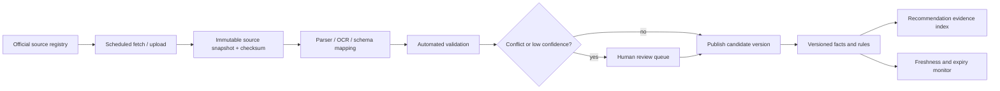

# Data, research, and AI strategy

Research date: 2026-07-19

This document defines what can be claimed, where evidence should come from, how it is versioned, and where AI is permitted. Exact fees, dates, rules, and quotas change frequently; source links are entry points, not timeless facts.

## Evidence policy

Every consequential value must carry:

- `source_id`, source URL, publisher, document title, and source type.
- Publication/fetch time, effective admission cycle, and (when applicable) counselling round.
- Page/table/row locator or extraction note and a content checksum.
- Acquisition method: API, download, HTML extraction, manual verification, or institution submission.
- Verification state: `unreviewed`, `machine_checked`, `human_verified`, `disputed`, `expired`.
- Reviewer and review time for human-verified data.
- Valid-from, valid-to, superseded-by, and next-review time.
- Per-field confidence based on source authority, directness, recency, agreement, and extraction quality.

Source priority:

1. Statute, regulator, counselling authority, examination authority, or scholarship owner.
2. Institution's signed/current notice, prospectus, fee order, accreditation page, or admissions portal.
3. Government/open-data dataset or regulator directory.
4. Accredited third-party aggregator only as a discovery hint; never the sole source for eligibility, fees, cutoffs, or deadlines.
5. Community input as a labelled anecdote pending verification.

Conflicts are preserved rather than overwritten. The UI should show the most authoritative current fact, flag disagreements, and link to the underlying records.

## Authoritative Indian education sources

### Institutions, recognition, and quality

| Domain | Primary source | Use | Important limitation |
|---|---|---|---|
| Universities | [UGC university directory](https://www.ugc.gov.in/universitydetails/) | Legal identity, type, address, recognition discovery | Confirm program/campus details separately; directory presence is not a quality score |
| Technical institutions | [AICTE](https://www.aicte-india.org/) approved-institution resources | Approval status and approved programs/intake | Approval is year/program/campus specific; capture the approval document and cycle |
| Medical colleges | [NMC college and course search](https://www.nmc.org.in/information-desk/college-and-course-search/) | Recognition, management, course, seats | Admission data still comes from MCC/state authorities |
| Online/ODL | [UGC-DEB](https://deb.ugc.ac.in/) and its [recognized programme list](https://deb.ugc.ac.in/Home/HEI_Prog_List) | Session-specific entitlement for online and distance programs | Recognition can vary by session and program |
| Institutional ranking | [NIRF 2025 rankings](https://www.nirfindia.org/Rankings/2025/Ranking.html) and [methodology](https://www.nirfindia.org/) | One transparent, year-specific quality signal | Do not turn rank into admission likelihood or use it as the only quality measure |
| Higher-education statistics | [AISHE](https://aishe.gov.in/) | Institution/population context and official aggregate statistics | Often lagged; not a current admissions feed |
| Other regulated programs | PCI, BCI, NCTE, INC, ICAR and relevant state regulator/authority sites | Program recognition for pharmacy, law, teaching, nursing, agriculture, etc. | Build regulator-specific connectors and verification rules |

Quality presentation should separate recognition, accreditation/ranking, outcomes, facilities, student experience, and fit. “Best college” is not a single valid score.

### Exams, counselling, cutoffs, seats, and deadlines

- [National Testing Agency](https://nta.ac.in/) for examination notices and links to current exam portals.
- [JoSAA opening/closing ranks](https://josaa.nic.in/document-category/or-cr/) and [archive](https://josaa.nic.in/archive/) for round-, institute-, program-, quota-, category-, seat-pool-, and year-specific engineering admissions.
- [Medical Counselling Committee current UG events](https://mcc.nic.in/current-events-ug/) and [archive](https://mcc.nic.in/archive-ug/) for central medical counselling notices, seat matrices, and results.
- Exam owners and counselling authorities for JEE, NEET, CUET, CLAT Consortium, UCEED/CEED, NID, NIFT, IISER/IAT, NEST, ICAR, state CETs, polytechnic, ITI, nursing, pharmacy, law, design, architecture, teaching, and university-specific admissions.
- Institution prospectuses only for institution-specific rules, with the exact cycle/document retained.

The system must model exam score and rank as different measures. “JEE” must not combine JEE Main and JEE Advanced. Every cutoff record needs admission cycle, round, counselling authority, program, campus, quota, category, seat pool/gender, domicile, measure type, opening value, closing value, and source.

### Scholarships and financial aid

- [National Scholarship Portal](https://scholarships.gov.in/) as the central discovery/application source where a scheme is hosted there.
- Scheme-owning ministry/department guidelines as the rule source. For example, the Ministry of Education publishes the current [PM-USP Central Sector Scheme guidelines](https://www.education.gov.in/sites/upload_files/mhrd/files/upload_document/PM_USP_CSSS_guidelines_updated.pdf).
- State scholarship portals, regulator schemes, institution financial-aid pages, and signed fee-waiver orders.

Store award components and timing, eligible program/institution types, income/category/gender/disability/domicile rules, academic thresholds, exclusion rules, renewal conditions, required documents, application windows, and a ruleset version. Never substitute “first scholarship in the list” for a rule match.

## Data acquisition and verification pipeline

Validation includes entity resolution, type/range checks, totals, cross-source comparison, duplicate detection, cycle continuity, and regression against prior snapshots. A change is never silently merged. Publication can be blocked when source coverage, reviewer sign-off, or freshness SLA is missing.

Suggested freshness:

- Live notices/deadlines: poll daily during active cycles; expire at deadline.
- Counselling ranks/seat matrices: ingest on publication and re-check daily during counselling.
- Fees/prospectuses: verify before each admission cycle and on change notices.
- Recognition/approval: verify per academic session and when a regulator changes status.
- Scholarships: verify before application season and on every revised guideline.
- Outcomes/rankings: version annually; never carry forward as current without a label.

## Fee research and total-cost methodology

### Required components

- Tuition by program, year/semester, category/quota/domicile, and admission cycle.
- One-time admission, caution, registration, examination, laboratory, library, technology, and student-activity fees.
- Hostel by room type, mess, utilities, laundry, deposits, and mandatory services.
- Books/equipment/software/uniform/clinical or studio costs.
- Travel and local living costs by location and student living choice.
- Expected annual escalation and the source/assumption behind it.
- Waivers, scholarships, stipends, refunds, and payment timing.

For each scenario and year `y`:

`gross_y = tuition_y + mandatory_y + housing_y + living_y + travel_y + materials_y + one_time_y`

`net_y = gross_y - confirmed_waivers_y - expected_aid_y`

`total_cost = sum(net_y)`

Expected aid must be shown separately from confirmed aid. If a scholarship has probability `p`, show a range/scenario, not a falsely precise subtraction. Produce at least low/base/high totals using explicit escalation and living-cost assumptions, plus the first-year cash requirement and recurring monthly burden.

Affordability should combine family contribution, timing, emergency buffer, education loan principal, interest/subsidy assumptions, and repayment scenarios. It must not equate a low annual fee with affordability.

## Competitive-exam and eligibility strategy

Eligibility is a versioned rules engine, not prose from an LLM. Each rule has:

- Authority, exam/admission cycle, program scope, and source locator.
- Age/date-of-birth, qualifying exam, subjects, marks/percentile, category relaxations, attempts, domicile, nationality, medical/physical, and prerequisite constraints.
- Structured expression plus plain-language explanation.
- `eligible`, `not_eligible`, or `needs_information`; missing facts never default to eligible.

Rules run before matching. Recommendations include required exams, application windows, preparation lead time, current official link, and an “as of” date. A monitor opens a review task when a current-cycle notice supersedes a rule.

## Scholarship matching strategy

1. Hard-filter on current scheme, deadline, citizenship/domicile, category, gender/disability (when applicable), income, institution/program, class/year, marks, and exclusion rules.
2. Return `eligible`, `likely_eligible_needs_documents`, `not_eligible`, or `unknown`; record which facts caused the outcome.
3. Rank only eligible/likely records by expected benefit, deadline urgency, rule fit, renewal value, and application effort.
4. Display amount as component/range and distinguish guaranteed entitlement from competitive selection.
5. Generate a document checklist and renewal calendar from structured rules.

## AI provider comparison

Provider details and model availability change; select by evaluated task class and record provider/model version on every run.

| Option | Strengths | Risks / limits | Recommended role |
|---|---|---|---|
| Direct Groq | Low-latency inference; official [structured outputs](https://console.groq.com/docs/structured-outputs) and documented [rate limits](https://console.groq.com/docs/rate-limits) | Strict schemas are model-dependent; one-provider dependency; model availability changes | Fast explanation and classification primary after an acceptance test passes |
| Direct Gemini | Structured output, long-context/caching options, multimodal capabilities; project-level [rate limits](https://ai.google.dev/gemini-api/docs/rate-limits) | Quotas and preview models vary; privacy/billing settings must be reviewed; long context is not a substitute for retrieval | Optional complex synthesis/multilingual fallback, evaluated on Indian-language and citation tasks |
| OpenRouter | [Provider routing](https://openrouter.ai/docs/guides/routing/provider-selection) and [model fallbacks](https://openrouter.ai/docs/guides/routing/model-fallbacks) reduce integration friction | Additional processor/control plane, routing variability, provider policy differences, and harder reproducibility | Optional resilience adapter, not the only production path |
| Hugging Face Inference Providers | Broad model/provider access, OpenAI-compatible chat, [structured output](https://huggingface.co/docs/inference-providers/en/guides/structured-output) | Quality, latency, residency, and feature support vary by selected provider/model | Evaluation sandbox and controlled open-model fallback |
| Ollama/local open models | Local processing, offline development, [JSON-schema output](https://docs.ollama.com/capabilities/structured-outputs), and [embeddings](https://docs.ollama.com/capabilities/embeddings) | Operational burden, hardware/capacity, weaker models on some tasks, local endpoint security | Developer mode, privacy-sensitive extraction/classification, disaster/manual fallback—not default internet production without GPU operations |

### Recommended architecture

Use an application-owned `AIProvider` interface with direct Groq as the initial low-latency provider, an independently configured secondary provider, and Ollama for local development. OpenRouter/Hugging Face can be adapters, not assumptions embedded in product code.

Route by task:

- Deterministic code: eligibility, costs, deadlines, ranking features, scholarship rules, probabilities, source selection.
- Small/fast model: intent classification, profile normalization, translation draft, summarization of already-selected evidence.
- Higher-quality model: final explanation comparing only supplied candidates/evidence.
- Embeddings/reranker: retrieval over approved evidence; never retrieval over unsourced web text for consequential facts.
- Human review: disputed data, safety escalations, mentor reports, and high-impact data changes.

All outputs require runtime schema validation (for example Zod), timeouts, capped exponential backoff with jitter for retryable failures, circuit breakers, per-task budgets, cache keys including profile/data/prompt/model versions, refusal handling, and a deterministic degraded response. Provider errors must never turn into invented guidance.

## Retrieval and anti-hallucination design

1. Query structured SQL/rules first to create eligible candidate IDs.
2. Retrieve only approved evidence chunks associated with those IDs and the active cycle.
3. Rerank by authority, scope match, recency, and semantic relevance.
4. Give the explanation model immutable candidate facts and evidence IDs; prohibit new institution names, numbers, deadlines, and eligibility claims.
5. Validate every claim-bearing output field against the candidate payload.
6. Render citations from evidence IDs server-side rather than trusting model-created URLs.
7. If evidence coverage is below threshold, return “insufficient verified data,” alternatives, and the official sources to check.

## Evaluation plan

- Golden profiles across class, board, category, state, income, disability, language, and rural/urban constraints.
- Rule truth tables for every active exam and scholarship ruleset.
- Historical cutoff backtests with temporal splits; no future-cycle leakage.
- Recommendation relevance judged by counsellors using blinded rubrics.
- Citation entailment, source authority, numeric exactness, schema validity, hallucination, harmful advice, and multilingual preservation tests.
- Fairness slices by protected/sensitive groups without using them as quality penalties.
- Online metrics: evidence coverage, save/compare/application actions, correction reports, deadline completion, and eventual outcomes—not clicks alone.

No “confidence” should be exposed as one number. Show evidence coverage, data recency, admission range uncertainty, and profile completeness separately.
