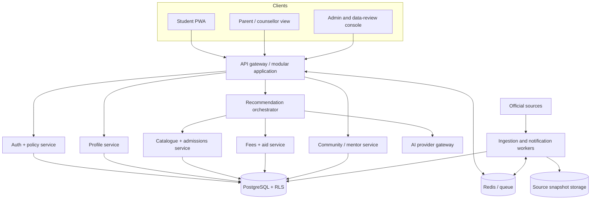
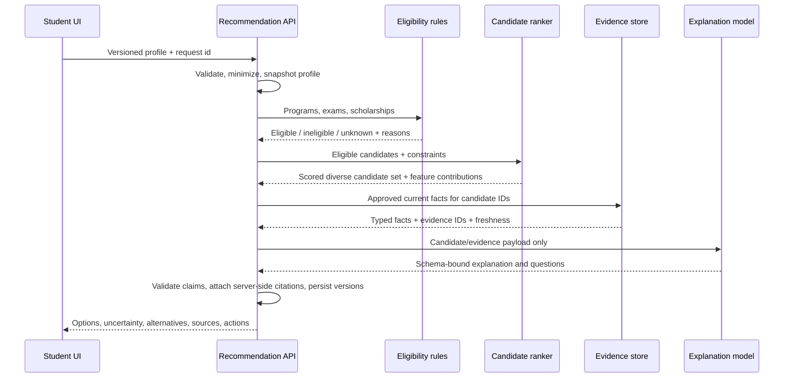
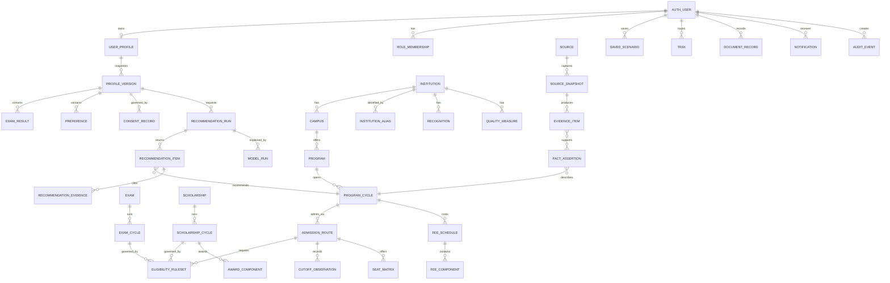

# Production target architecture

This is the recommended evolution of the existing React, Express, and Supabase stack. It is intentionally modular without starting as microservices. Extract services only after scale or ownership demonstrates a need.

## Product principles

1. Evidence before eloquence: every consequential claim is traceable to a current source.
2. Rules before models: eligibility, money, deadlines, and admission history are deterministic.
3. Honest uncertainty: ranges, missing data, and alternative paths are visible.
4. Actionable output: every option has next steps, official links, deadlines, documents, and a backup.
5. Privacy by default: minimize minor/student data, obtain versioned consent, and make deletion/export operational.
6. Works where students are: mobile-first, multilingual, low-bandwidth, printable, and compatible with assisted use.

## Recommended stack

| Layer | Recommendation | Reason |
|---|---|---|
| Web | React + TypeScript, Vite, React Router, TanStack Query, React Hook Form + Zod, Tailwind | Reuses the current product while adding contracts, request state, resilient forms, and route splitting |
| PWA | Service worker through a maintained Vite PWA integration, offline form drafts, cached read-only evidence | Low-bandwidth and interrupted-session support |
| API | Node 22 LTS, TypeScript, Fastify or modular Express, Zod/OpenAPI, Pino, OpenTelemetry | Typed contracts, modular domains, structured logs, observability; Express can be retained initially to lower migration risk |
| Data | Managed PostgreSQL/Supabase, PostGIS where distance is needed, `pgvector` only for approved evidence retrieval | Strong relational rules, RLS, versioning, geospatial fit, and one operational database initially |
| Cache/limits/jobs | Managed Redis plus a durable job queue (BullMQ or cloud equivalent) | Distributed rate limits, idempotency, caching, scheduled ingestion, retries, and review work |
| Object storage | Private Supabase Storage or S3-compatible storage | Immutable source snapshots, documents, exports, and malware-scanned uploads |
| Auth | Supabase Auth with server-controlled role memberships and step-up/MFA for staff | Reuse current auth while removing self-writable roles |
| AI | Application-owned provider gateway, Zod schemas, approved evidence retrieval, direct primary + independent fallback | Avoid lock-in and stop model output from becoming fact |
| Delivery | Docker, GitHub Actions, managed web/API/worker deployments, migration job, preview environments | Repeatability, safe promotion, rollback, and separated worker scaling |
| Observability | OpenTelemetry traces/metrics, structured logs, error tracking, uptime checks, data freshness dashboards | Product, model, data, and operations can be monitored together |

## Logical architecture



Start as one API deployment with domain modules and one worker deployment. Modules have explicit ports/interfaces and cannot read each other's tables through ad hoc route code.

## Recommendation agent workflow



If rules, evidence, AI, or persistence fails, the API returns a typed partial/degraded result. It never substitutes fabricated content.

## Proposed database model



### Important modelling choices

- Stable IDs and aliases separate an institution from its campuses and programs.
- `program_cycle` carries year-specific admissions state; nothing current is stored as an unqualified timeless value.
- `admission_route` captures exam, counselling authority, quota, category rules, and route-specific constraints.
- Source snapshots are immutable; corrected facts supersede earlier assertions.
- Recommendation runs store input profile version, data snapshot/version, engine version, feature contributions, evidence coverage, prompt version, provider/model, latency, cost, and outcome—not hidden chain-of-thought.
- Sensitive demographic attributes are encrypted/restricted and used only where legally relevant or for consented fairness evaluation.
- PII, mentor safeguarding records, chat, and analytical events have separate retention policies.

## Onboarding and profile design

Use progressive disclosure and autosave. Ask only what is needed for the selected journey and explain why sensitive fields matter.

### Identity and study stage

- Preferred name, age band/date-of-birth only where eligibility requires it, class/year, board, medium/languages, school type, state/district/pincode.
- Student/parent/assisted mode and accessibility needs.

### Academic evidence

- Subject-level marks/grades, current/predicted status, backlogs/gaps, qualifications.
- Exam registrations/results: exact exam, cycle, score/percentile/rank, category rank, attempt, and uploaded proof status.

### Eligibility attributes

- Domicile, citizenship/nationality when required, reservation/category and certificate status, gender/seat-pool relevance, disability, minority/defence/other quotas—each optional until a route requires it and protected by explicit purpose/consent.

### Interests and fit

- Subjects enjoyed/avoided, career themes, work activities, values, desired education level, preferred course families, confidence, and constraints. Interest quiz outputs are hints, never ability diagnoses.

### Location and lifestyle

- Preferred states/cities, maximum distance/travel time, same-city requirement, hostel/commute choice, campus environment, language comfort, safety/accessibility needs.

### Money and family constraints

- Maximum first-year and total budget, monthly family contribution, income band, available savings, loan openness, first-generation status, scholarship priorities, and earning urgency.

### Goals and decision state

- Target roles/sectors, fallback tolerance, preferred balance of cost/selectivity/location, application status, parent concerns, deadlines, and unknown questions.

Every section shows completion and last-saved state. A student can skip, correct, export, or delete data, and changing a material field creates a new profile version and invalidates affected recommendations.

## Recommendation engine

### Pipeline

1. Validate and normalize the profile; identify missing decision-critical facts.
2. Apply hard eligibility rules to program-cycle/admission-route records.
3. Generate candidates satisfying location, program level, recognition, active cycle, and evidence freshness requirements.
4. Compute transparent features: academic fit, admission range, affordability, interest/goal fit, location/lifestyle fit, quality evidence, support/accessibility, and evidence completeness.
5. Normalize features within relevant peer groups; do not compare unrelated programs with one global prestige score.
6. Apply student-selected trade-off weights within safe bounds.
7. Diversify results across course/pathway/selectivity and include at least one affordable and one resilient fallback when available.
8. Produce explanation from feature contributions and source records; the LLM improves language only.

Illustrative score—not a finalized production formula:

`fit = eligibility_gate * (0.24 academic + 0.22 affordability + 0.18 goals + 0.14 location + 0.10 admission_range + 0.07 quality + 0.05 support)`

Weights are versioned and evaluated. Protected attributes are used only for valid eligibility/aid routes, never as negative quality signals. Missing data reduces evidence coverage rather than silently applying a zero.

### Recommendation output contract

Each option should include:

- Exact institution, campus, program, credential, active admission cycle, and recognition status.
- Why it fits and feature-level trade-offs.
- Eligibility result and missing facts.
- Required exams, route/counselling, likely application timeline, and official links.
- Admission range with round/category/quota/domicile context and limitations.
- First-year and total low/base/high cost, assumptions, and cash-flow timing.
- Matched scholarships with rule result and documents.
- Curriculum/learning style, likely pathways, and evidence-labelled outcomes where available.
- Risks, watch-outs, questions to ask, comparable alternatives, and fallback routes.
- Evidence coverage, freshness, engine version, generated time, and citations.

## Admission probability methodology

Do not launch a percentage until enough historical observations and backtesting exist. Initially present evidence-based bands.

### Data grain

Partition by program/campus, exam, counselling authority, quota, category, seat pool/gender, domicile, round, admission cycle, and rank/score measure. Never impute across incompatible partitions without an explicit hierarchical model and uncertainty penalty.

### Baseline bands

- Calculate recent-cycle cutoff distributions with time decay and robust outlier handling.
- Compare candidate rank in the correct direction and partition.
- Produce conservative/central/optimistic thresholds with sample size, years available, volatility, and policy-change warnings.
- Separate qualification from seat-allocation likelihood.

### Later calibrated model

Use a monotonic interpretable model (for example isotonic/logistic calibration over rank-relative features) or hierarchical Bayesian model when actual allotment outcomes are available. Train only on cycles before the evaluation cycle. Report Brier score, calibration error/curves, log loss, coverage, and slice metrics. Recalibrate per counselling system. Abstain when data is sparse or rules changed.

Labels such as “likely” must map to validated intervals and include “not a guarantee.” Institution-level historical cutoffs alone cannot prove personal admission probability.

## Fee and affordability engine

The engine joins program-cycle fee schedules with student living choices and aid rules. It returns annual component tables and low/base/high scenarios, never one opaque yearly number. Assumptions are editable. Scholarship and loan effects remain distinct, and expected/competitive aid cannot be presented as guaranteed.

Calculations are pure, versioned functions with golden tests. Currency is integer paise or exact decimal, never binary floating point. Every source-derived input has an evidence link; every assumption is visibly labelled.

## API design

Base path: `/api/v1`. JSON uses a consistent envelope:

```json
{
  "data": {},
  "meta": { "requestId": "...", "asOf": "...", "dataVersion": "..." },
  "errors": []
}
```

Key resources:

| Method and path | Purpose |
|---|---|
| `GET /health/live`, `GET /health/ready` | Process and dependency readiness |
| `GET /me`, `PATCH /me` | Account preferences, locale, privacy controls |
| `POST /profiles`, `PATCH /profiles/{id}`, `POST /profiles/{id}/versions` | Autosaved profile and immutable decision versions |
| `POST /eligibility/evaluate` | Typed exam/program/scholarship rule evaluation |
| `POST /recommendation-runs` | Idempotently start a versioned recommendation run |
| `GET /recommendation-runs/{id}` | Return progress/partial/final results and evidence coverage |
| `GET /institutions`, `GET /program-cycles` | Filtered, paginated catalogue with freshness metadata |
| `GET /program-cycles/{id}/admissions` | Routes, rules, cutoffs, seats, deadlines |
| `POST /admission-estimates` | Context-correct range/probability estimate |
| `POST /cost-estimates` | Component-level cost/aid/loan scenarios |
| `GET /scholarship-cycles`, `POST /scholarship-matches` | Current schemes and explainable rule matches |
| `GET/POST/DELETE /saved-scenarios` | Server-backed comparisons |
| `GET/POST/PATCH /tasks` | Application/deadline checklist |
| `GET /sources/{id}`, `POST /facts/{id}/reports` | Evidence drill-down and correction reports |
| `GET/POST /mentors`, `/mentor-sessions`, `/conversations` | Verified, safeguarded community workflows |
| `GET/PATCH /notifications` | Server-created notifications and read state |
| `POST /privacy/exports`, `POST /privacy/deletions` | Data rights workflows |
| `POST /admin/source-imports`, `GET /admin/review-queue` | Staff-only ingestion/review |

All list endpoints use cursor pagination, filter allowlists, maximum page sizes, and ETags. Writes use idempotency keys where retry is likely. Validation errors are machine-readable. OpenAPI is generated from the same schemas used at runtime and by the frontend client.

## Security, privacy, and authorization

- Server-controlled `role_memberships`; no role column in a user-writable profile.
- Default-deny RLS plus integration tests using anonymous/student/mentor/reviewer/admin tokens.
- Backend-for-frontend for sensitive writes; narrowly scoped database RPCs where direct realtime access remains.
- Short-lived access tokens, MFA/step-up for staff, session/device controls, and admin audit trails.
- Strict CORS allowlist, security headers, body/content limits, distributed account/IP/device rate limits, abuse challenges, and web-application firewall controls.
- Secrets in a managed secret store, automatic secret/dependency scanning, rotation, and no credentials in examples.
- Data inventory and classification, encryption in transit/at rest, field-level protection where appropriate, backups, tested restoration, retention jobs, export/delete workflows, and vendor/subprocessor review.
- Versioned consent with purpose, locale, policy version, guardian state, withdrawal, and minimal collection for minors.
- Mentor identity/credential verification, code of conduct, report/block/moderation, guardian safety controls, and escalation procedures.

## UX, accessibility, multilingual, and low bandwidth

- WCAG 2.2 AA target, semantic dialog/forms, keyboard testing, live status/error regions, contrast automation, reduced-motion support, and accessible charts/tables.
- Mobile-first progressive steps; large tap targets; no hover-only actions; resilient draft save; concise initial results with expandable evidence.
- Internationalize all strings and content fields from the start; locale-aware dates/numbers/currency, font coverage, glossary review, and human validation for high-impact translations.
- Server-generated printable/PDF summary, shareable consented parent view, and assisted counsellor mode.
- PWA caches the shell, profile draft, saved summaries, and source metadata; recommendations that require current data are labelled unavailable/stale offline.
- Text-first payloads, compressed/lazy assets, route splitting, skeletons, data-saver mode, and no mandatory video/audio.

## Testing and release gates

### Test pyramid

- Unit: fee/rule/ranking functions, validators, cache keys, source confidence, and permission decisions.
- Contract: OpenAPI request/response fixtures and provider adapters.
- Database: migrations, constraints, RLS policy matrix, rollback/forward compatibility.
- Data: schema, source freshness, entity duplicates, invalid cycles, cutoff partitions, fee totals, and conflict detection.
- Model/recommendation: golden profiles, citation faithfulness, no-new-facts validation, calibration, fairness slices, prompt injection, multilingual tests.
- Component/accessibility: critical UI states and automated axe checks.
- E2E: anonymous onboarding, login/linking, recommendation, compare/save, parent/print, mentor safety, data export/delete, and degraded provider/data states.
- Performance/security: low-end mobile budgets, API load, queue behavior, dependency/container scans, SAST, secret scan, DAST, and abuse tests.

### CI/CD gates

Every pull request runs formatting, lint, typecheck, unit/component/contract/database tests, migration validation, source-data checks, build, dependency/secret/SAST scans, and preview smoke tests. Main deploys immutable artifacts to staging, runs E2E and migration rehearsal, then promotes with approval/canary. Migrations are expand/contract and independently observable. Rollback, backup restore, and provider-degradation drills are documented and exercised.

## Observability and service objectives

Capture request/trace IDs across browser, API, queue, database, and AI calls. Logs are structured and redact PII/secrets. Metrics include latency/error/saturation, cache and queue behavior, provider tokens/cost/fallbacks/schema failures, data-source freshness/conflicts, recommendation evidence coverage/abstention, eligibility corrections, mentor safety events, and outcome feedback.

Initial objectives should be measured before promises are published. Suggested starting goals: 99.9% monthly API availability excluding declared maintenance, p95 cached read under 500 ms, p95 deterministic recommendation preparation under 2 s, bounded AI explanation timeout with deterministic fallback, and zero published expired critical facts. Alerts must route to an owned runbook.
